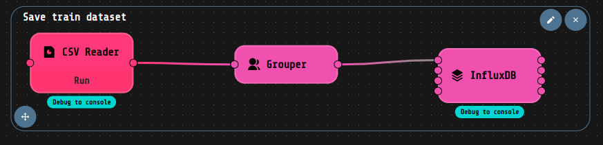
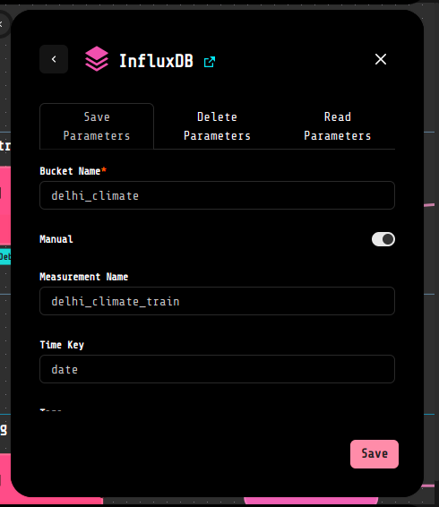
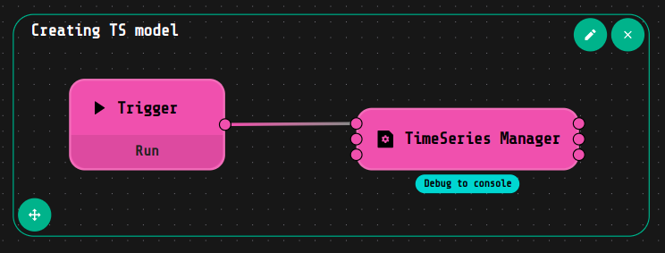
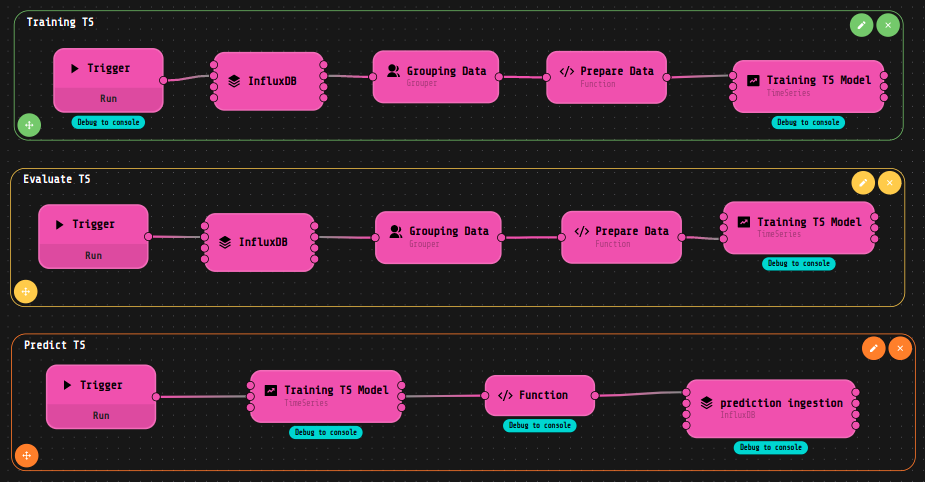
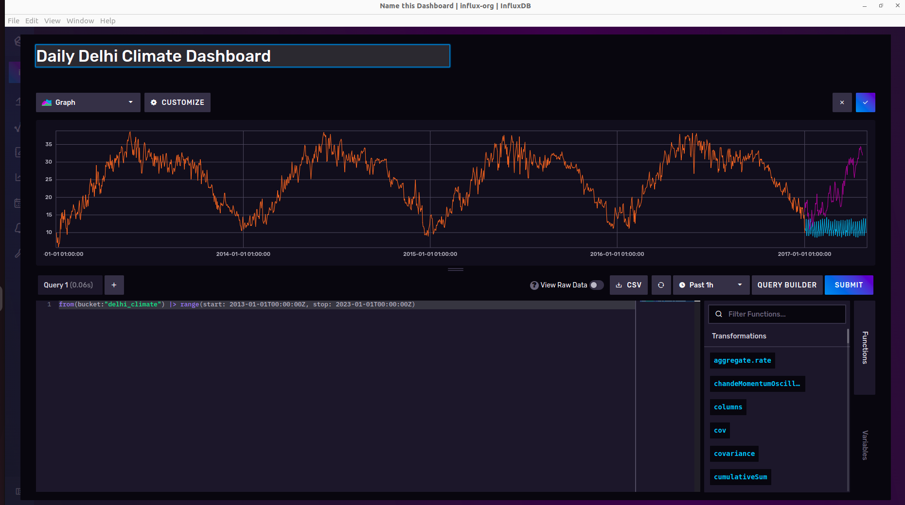

# :chart_with_upwards_trend: Time series demo

This LOKO AI projects contains a workflow which allows to handle time series data, from the ingestion of the data in a database (Influx-DB) to the prediction of the temporal data. 

In this demo we used a public dataset, downloaded from [Kaggle](https://www.kaggle.com/datasets/sumanthvrao/daily-climate-time-series-data?resource=download), concerning weather data in Delhi, particularly the daily average temperature. There are two csv files, which are used for the train and test of the time-series model. These two documents will be ingested in a InfluxDB database, through the _influxdb-grafana-ext_ extension, which can also be used to query, plot and dashboard creation. This extension offers a direct access to InfluxDB and Grafana GUIs. The ingested data will then be used to train an Arima model, using the _loko-time-series_ extension. The first step is the creation of the time series predictor itself. Afterwards it's possible to fit the model, and eventually use the trained model to predict next _n_ days average temperature and evaluate the model performances.

# :mag_right: How make it work?

The first step is to run the _loko-time-series_ and _influxdb-grafana-ext_ extension and the project _time_series_demo_ itself. 

It's also required to setup the influz-db-grafana component, the instruction to guide you during the whole process are available [here](https://github.com/loko-ai/influxdb-grafana-ext). After all is setup, the next step is to create a Bucket from the InfluxDB GUI using the name _"delhi_climate"_, as written in the field _"Bucket Name"_ of the InfluxDB block. Now you can run the first two flows, which ingest the train and test data into InfluxDB.

 

Now, you can create the time series predictor with the following flow. It will create an Arima model, and use as a transformer for the target a pipeline which will deasesonlize and detrend the data. 

You can use the remaining three flows to train the model, evaluate it and make prediction, which can be on their turn ingest in another InfluxDB measurement.

Finally, if you want to query the database and take a look at the date you can either use the InfluxDB or Grafana GUI and watch to the plot using the following query:

    from(bucket:"delhi_climate") |> range(start: 2013-01-01T00:00:00Z, stop: 2023-01-01T00:00:00Z) 

